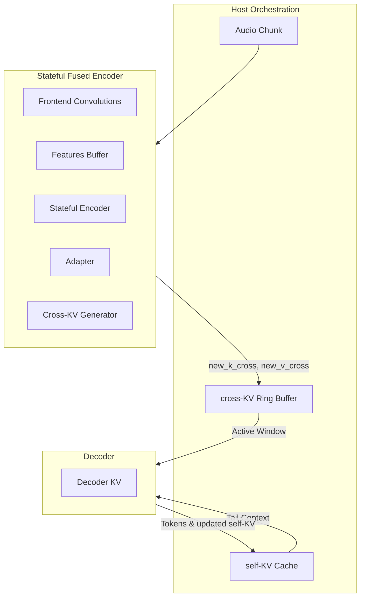

# Plan: Moonshine Streaming 2-Split Optimization

This document outlines the design and implementation plan for optimizing the Moonshine Streaming orchestration pipeline by moving from a **5-split model architecture** (`frontend`, `encoder`, `adapter`, `cross_kv`, `decoder_kv`) to an optimized **2-split model architecture** (`fused_encoder`, `decoder`).

---

## 1. Objectives

1. **Reduce Host-Device Launch Overhead:**
   * Cut the number of model dispatches from 4 down to 1 for each processed audio chunk.
   * In a 1.6s preview window (20 chunks), this reduces chunk processing dispatches from **80 launches to 20 launches**, saving significant host-device latency.
2. **Improve Memory Locality & SRAM Reuse:**
   * Keep intermediate activations (between frontend, encoder, adapter, and cross-KV layers) resident on-device, enabling the compiler to optimize cache lines/LRAM usage.
3. **Preserve Rolling-Window Compatibility:**
   * Ensure 100% compatibility with the sliding cross-KV ring buffer (`state.k_cross`/`state.v_cross`) and the rolling-window committed-prefix decode algorithm used in `full_streaming_demo.py`.

---

## 2. 2-Split Architecture Design



### Model 1: Stateful Fused Encoder (`fused_encoder.onnx`)
A unified wrapper module combining the frontend, encoder, adapter, and cross-KV generation.

#### Inputs:
1. `audio_chunk`: `[1, chunk_len]` (e.g., 1280 PCM samples)
2. `conv1_buffer`: `[1, conv1_channels, 4]` (conv1 causal history)
3. `conv2_buffer`: `[1, conv2_channels, 4]` (conv2 causal history)
4. `features_buffer`: `[1, total_lookahead, hidden_size]` (accumulated frontend features for right-context lookahead)
5. `position_embeddings`: `[1, F, hidden_size]` (looked up on the host to avoid compiling the large embedding table inside ONNX)
6. `buf_0` ... `buf_5`: `[1, left_ctx_i, hidden_size]` (transformer encoder sliding window caches)

#### Outputs:
1. `new_k_cross`: `[depth, 1, heads, F, head_dim]` (new cross-K)
2. `new_v_cross`: `[depth, 1, heads, F, head_dim]` (new cross-V)
3. `conv1_buffer_out`: `[1, conv1_channels, 4]`
4. `conv2_buffer_out`: `[1, conv2_channels, 4]`
5. `features_buffer_out`: `[1, total_lookahead, hidden_size]`
6. `buf_0_out` ... `buf_5_out`: `[1, left_ctx_i, hidden_size]`

#### Internal Forward Flow (PyTorch):
```python
class StatefulFusedEncoderWrapper(torch.nn.Module):
    def __init__(self, model, chunk_len: int):
        super().__init__()
        self.frontend = StaticStreamingFrontendWrapper(model, chunk_len)
        self.encoder = StatefulEncoderWrapper(model)
        self.adapter = AdapterWrapper(model.model.decoder)
        self.cross_kv = CrossKVGeneratorWrapper(model.model.decoder)
        self.F = self.frontend.n_frames
        self.total_la = self.encoder._total_lookahead

    def forward(self, audio_chunk, conv1_buffer, conv2_buffer, features_buffer, 
                position_embeddings,
                buf_0, buf_1, buf_2, buf_3, buf_4, buf_5):
        # 1. Frontend feature extraction
        new_feats, conv1_buf_out, conv2_buf_out = self.frontend(
            audio_chunk, conv1_buffer, conv2_buffer
        )

        # 2. Append features to rolling buffer for lookahead resolution
        combined = torch.cat([features_buffer, new_feats], dim=1)
        stable_features = combined[:, :self.F, :]
        features_buffer_out = combined[:, self.F:, :]  # keeps total_la frames
        right_ctx = features_buffer_out

        # 3. Sliding-window encoder
        encoded, buf0_out, buf1_out, buf2_out, buf3_out, buf4_out, buf5_out = self.encoder(
            stable_features, right_ctx, buf_0, buf_1, buf_2, buf_3, buf_4, buf_5
        )

        # 4. Positional embeddings projection
        memory = self.adapter(encoded, position_embeddings)

        # 5. Cross-KV generation
        k_cross, v_cross = self.cross_kv(memory)

        return (k_cross, v_cross, conv1_buf_out, conv2_buf_out, features_buffer_out,
                buf0_out, buf1_out, buf2_out, buf3_out, buf4_out, buf5_out)
```

---

### Model 2: Optimized Decoder (`decoder_kv.onnx`)
Reuses the highly-optimized static shape wrapper from the 5-split implementation (`DecoderKVWrapper`). It bypasses the encoder projection phase and cross-KV generation entirely.

#### Inputs:
1. `token` (or `inputs_embeds` if embeddings are extracted on the host)
2. `k_self_0` ... `v_self_5`: `[1, heads, max_tokens, head_dim]` (self-KV cache)
3. `k_cross_0` ... `v_cross_5`: `[1, heads, max_memory_len, head_dim]` (active window from the host cross-KV ring buffer)
4. `cross_attn_bias`: `[1, heads, 1, max_memory_len]`
5. `position_ids`: `[1, 1]`

#### Outputs:
1. `logits`: `[1, 1, vocab_size]`
2. updated self-KV caches (`out_k_self_0` ... `out_v_self_5`)

---

## 3. Host-Side Warmup & Lookahead Synchronization

To avoid compiling complex conditional branches (ONNX `If` operators) into hardware accelerator binaries, the warmup logic is managed directly on the host using straight-line, static ONNX runs:

1. **Initial State Initialization:**
   * Allocate conv state buffers (`conv1_buffer`, `conv2_buffer`) and lookahead feature buffer (`features_buffer`) as zeros.
   * `chunk_idx = 0`.
2. **Warmup Steps (`chunk_idx < warmup_chunks`):**
   * Run the `fused_encoder` model.
   * Pass all-zero matrices for `buf_0` ... `buf_5` (no left context exists yet).
   * Store/update frontend buffers: `conv1_buffer`, `conv2_buffer`, and `features_buffer`.
   * **Discard** the outputs `k_cross`/`v_cross` and `buf_i_out`.
3. **Active Steps (`chunk_idx >= warmup_chunks`):**
   * Run the `fused_encoder` model.
   * Pass actual updated sliding-window buffers (`buf_0` ... `buf_5`).
   * Update frontend buffers: `conv1_buffer`, `conv2_buffer`, and `features_buffer`.
   * Update encoder buffers: `buf_i = buf_i_out`.
   * Append `new_k_cross` and `new_v_cross` to the host-side sliding ring buffer (`state.k_cross` / `state.v_cross`).

---

## 4. Implementation Steps

1. **Create the target directory:** `moonshine_streaming_2_split/`
2. **Create wrapper definitions:** Define `StatefulFusedEncoderWrapper` and `DecoderKVWrapper` in `export.py`.
3. **Implement ONNX Graph Surgeon Edits:** Update the ONNX Graph Editor script to cleanly fix shapes, decompose LayerNorm, decompose boolean `And` operators, and handle other accelerator-specific graph rewrites.
4. **Compile to VMFB:** Validate compilation parity on the target hardware using the Synaptics compiler.
5. **Update Orchestration Drivers:** Support the unified `fused_encoder` buffer updates and warmup routines in both baseline (`orchestrated_demo_vmfb.py`) and rolling-window (`full_streaming_demo.py`) scripts.
